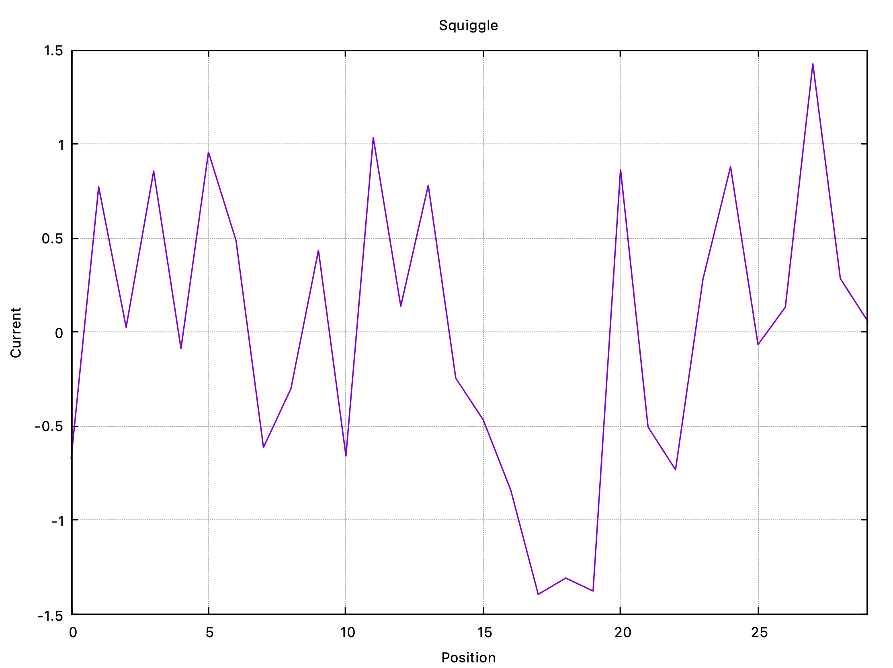
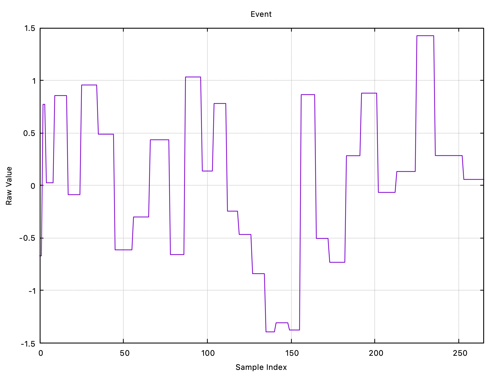
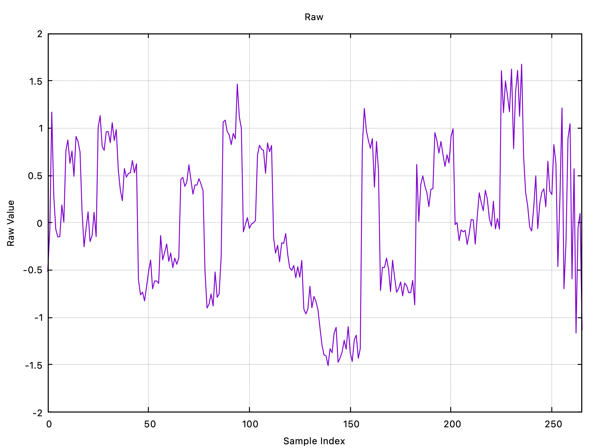
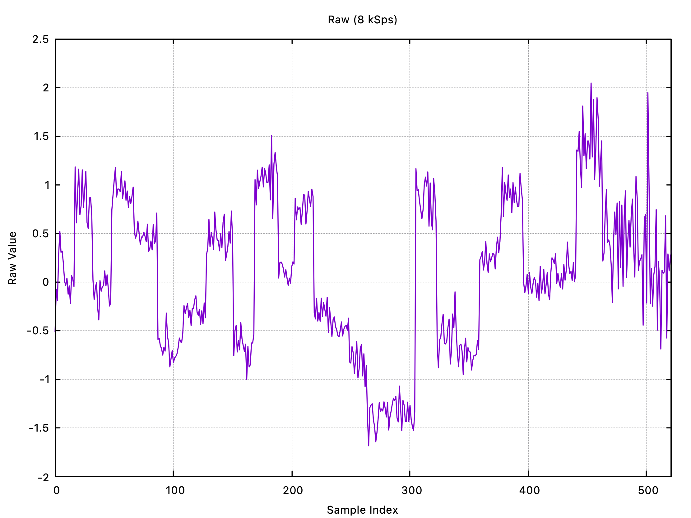

<!-- # Sequelizer -->

<picture>
  
</picture>

**
Nanopore bioinformatics for edge computing
**

  
  
  
  

---

  
All bases, all the time.   
That's Sequelizer's motto.   
Genomics everywhere is its mission. 

# The Now

Research toolkit for hardware/software co-design in bioinformatics. RISC-V ready. Hackable. Open.

# The Vision

Genomics computation is stuck in the cloud.  It's big science on big machines for specialists.  That's fine, but our bodies and environments are writing biomolecular messages constantly.  What is it? What does it mean?

Like a smartwatch reports basic vitals, we want the same for biomolecular activity, deep insights where they happen, as they happen, privately, in real-time, on-device.  Think genomic monitoring with a toothbrush, enivoronmental sensing with a drone.

Hardware advances are making this possible - mini sequncers, custom silicon, smarter AI.  But current bioinformatics tools are not designed for edge devices.  They assume powerful servers, high bandwidth, abundant storage.  This prevents real-time analysis and throttles access.

That's where Sequelizer comes in.  It's the software component of new hardware-algorithm co-designs for nanopore bioinformatics at the edge, mobile genomics in short.

<!-- We're building toward ubiquitous sequencing - sensors integrated into everyday 
devices, continuously monitoring biology in real-time. That future needs 
computation at the edge: custom AI accelerators processing nanopore streams 
as they're generated, not gigabytes uploaded to distant servers. -->

